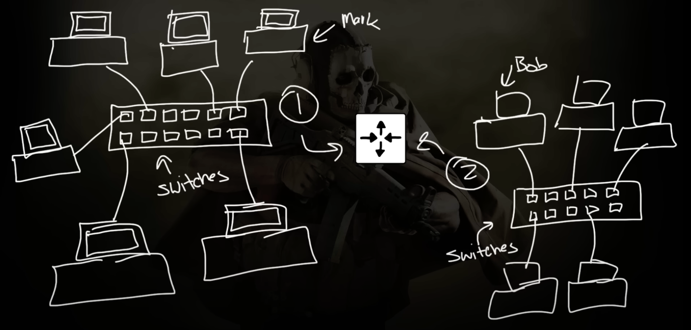
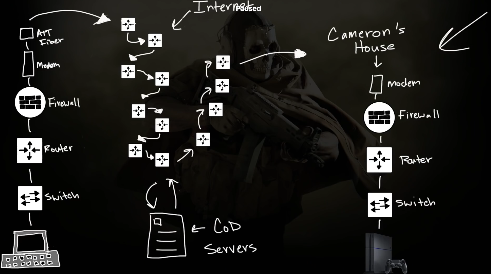
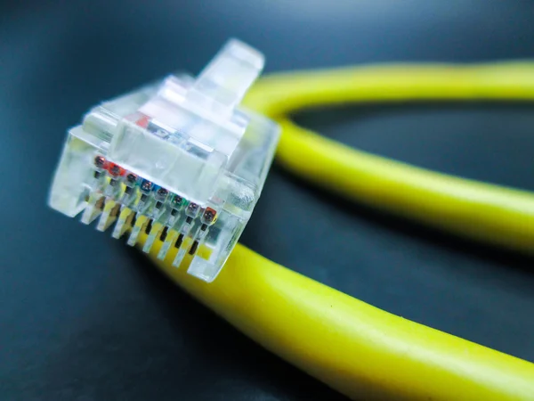
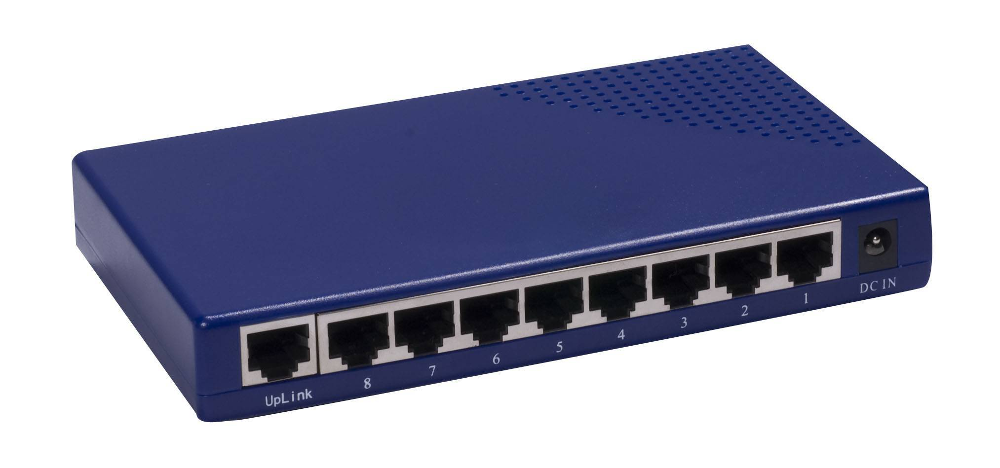
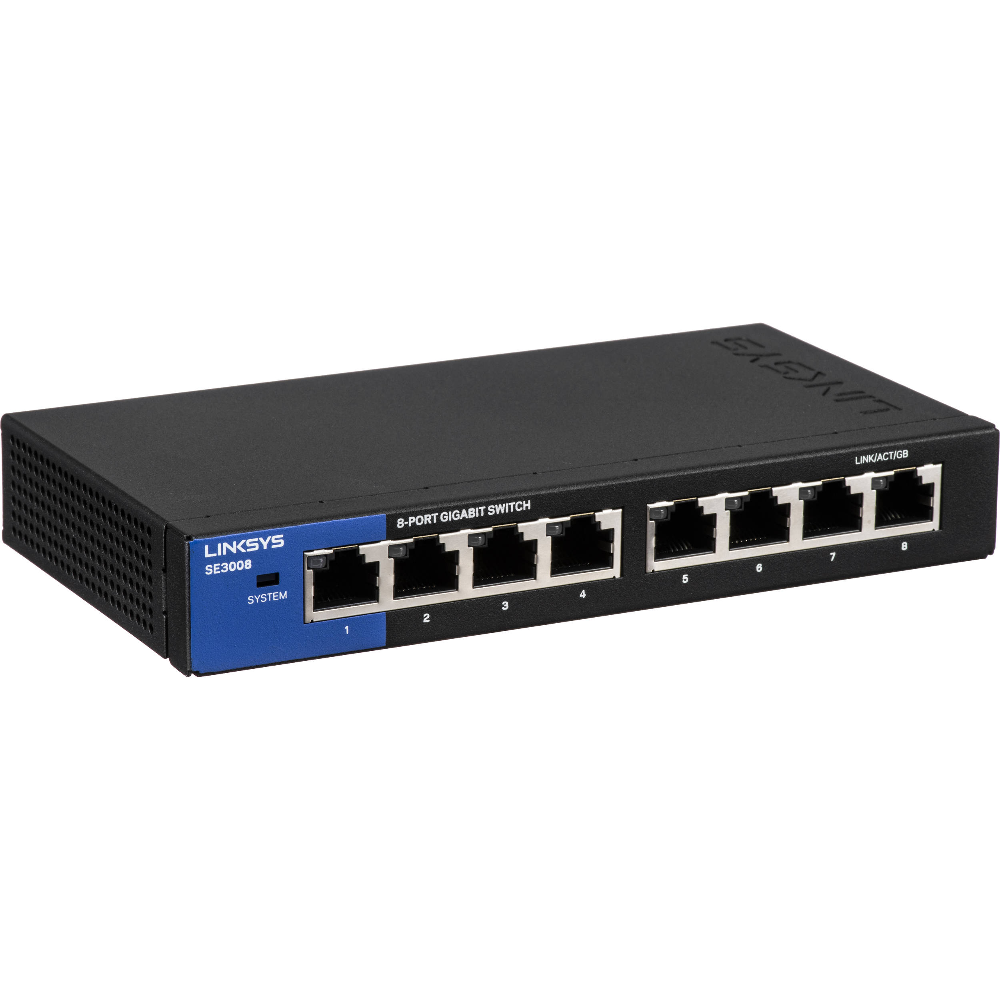
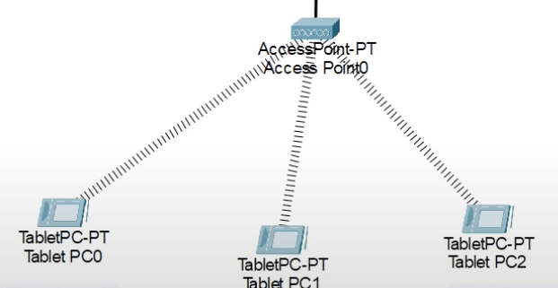
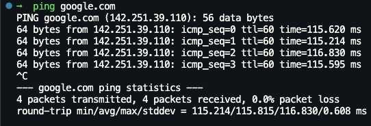

# Contents
- [NetworkChuck](#networkchuck)

# NetworkChuck
It's a summary of this [course](https://www.youtube.com/playlist?list=PLIhvC56v63IJVXv0GJcl9vO5Z6znCVb1P) by NetworkChuck.

- [EP_0](#ep_0)
- [EP_1](#ep_1)
- [EP_2](#ep_2)

## `EP_0`

  <h1>Switch vs Router</h1>

  

- Switch: Layer 2, MAC address, CAM(Content Addressable Memory) table, local network
- Router: Layer 3, IP address, global network

  <h1>Network</h1>

## `EP_1`

**Ethernet Cable**: Connects devices to a hub, switch, or router.

**Hub**: Connects multiple devices together. It's a Layer 1(Physical layer) device. It's a multi-port repeater. It's a broadcast device. it doesn't have any intelligence. It's a dumb device. His job is repeat electrical signals.  

**Switch**: Connects multiple devices together. It's a Layer 2 device. It has brain. It's a smart device. It has a CAM table which contains a map between Port and MAC address. It use source MAC address to populate the CAM table. It sends `Frames`(Packet is for layer 3!) to the correct port.

**Wireless Access Point(WAP)**: They are more like hub than switch. They're kind of dumb like hub. They send the same signal to all the devices.

 

Summary:  
Layer 1: Physical layer, electrical signals, hub, cable, port  
Layer 2: Mac address, switch, CAM table, Frame  
Layer 3: IP address, packet

***Tools***:  
**Ping**: We use it to see if other computers or servers are up and can be reached.

You can you [Cisco Packet Tracer](https://www.youtube.com/redirect?event=video_description&redir_token=QUFFLUhqa3FmbmxlU3d4MGFtTU82eGxPTEFOUWVmT1BMQXxBQ3Jtc0ttcXE1MHBNZ19nUXFtSlhSX0tUeVNacFVnS3o0dFNieVNOWmpUbmFTeVo4aC0tVnd6amlLaldIV0xaRVQ5UHA1cGZFXy10WS1saGk1M0tfX08zeGtPNDNCNDhaTTRlWmNkLTcyd3FYODB2MVdFWHM2SQ&q=https%3A%2F%2Fbit.ly%2Fpacktracer&v=9eH16Fxeb9o) to simulate the network.  

## `EP_2`